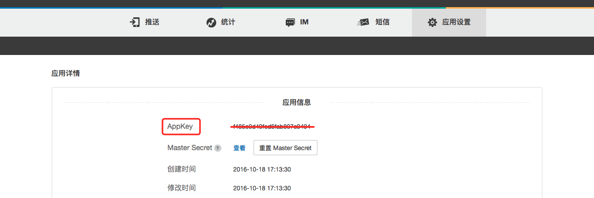

# [Integration Guide of JStatistics iOS SDK](https://docs.jiguang.cn/janalytics/client/android_guide/)

## Use Suggestions

This article is an integration guide document of the JAnalytics iOS SDK standard.

The matching SDK version is v1.0.0 and later.

-   If you want to test quickly, please refer to this article to run the Demo in minutes.

-   All documents, including all guides, APIs, and tutorials, are available on the JPush Doc website. Updated versions of this document will also be posted to the website in a timely manner.

## 

## Product Function Description

Event templates are used to count App users' behavior events and report them to Jiguang servers. Jiguang provides processed data to developers through Web Portal, allowing developers to better understand the use of their products in the hands of users.

### Main scenes：
```
1. Statistics page flow

2. Statistical events: JAnalytics models event statistics and currently provides six event models (login, registration, purchase, content browsing, custom count events, custom calculation events).
```

### Content of Integrated Archive

-   janalytics-ios-x.x.x.a static library

-   jcore-ios-x.x.x.a static library

-   header file of statistics portal JANALYTICSService.h

-   header file of statistics event object file JANALYTICSEventObject.h

-   A complete iOS Demo project that demonstrates the basic usage of the JAnalytics SDK and can be used as a reference

### iOS SDK Version

The current SDK only supports iOS 7 or later mobile phone systems.

## Create an Application
AppKey is automatically generated to identify the application after successful creation.




## Import SDK

**Option 1: Import Cocoapods**

-   Download address through Cocoapods:
```
pod 'JAnalytics'
```

-   If you want to install the specified version, use the following methods (take the 1.2.0 version as an example):
```
pod 'JAnalytics', '1.2.0'
```

**Option 2: Manual Import**

-   Download the <span class="underline">[ latest SDK](http://docs.jiguang.cn/janalytics/resources/)</span> on Jiguang official website

-   Extract the compressed package and copy all files under Lib to the project

-   Increase related framework dependencies

    -   UIKit

    -   SystemConfiguration

    -   CoreTelephony

    -   CoreGraphics

    -   Security

    -   Foundation

    -   CoreLocation

    -   CoreFoundation

    -   CFNetwork

    -   libz.tbd

    -   libresolv.tbd

-   You can start using the statistics SDK!

## Add Header Files

Please add the following code to the location where the AppDelegate.m refers header file

```
    // 引入JAnalytics功能所需头文件
	#import "JANALYTICSService.h"
	// 如果需要使用idfa功能所需要引入的头文件（可选）
	#import <AdSupport/AdSupport.h>
```

## Add Initialization Code

Please add the following code to 
-(BOOL)application:(UIApplication \*)application didFinishLaunchingWithOptions:(NSDictionary \*)launchOptions

```
JANALYTICSLaunchConfig * config = [[JANALYTICSLaunchConfig alloc] init];
 
	config.appKey = @"your appkey";
	 
	config.channel = @"channel";
	 
	[JANALYTICSService setupWithConfig:config];
```

### More APIs

For the usage of other APIs, please refer to the interface document: [iOS SDK API](ios_api)

### Run the demo

The demo attached with the package is an API demo example. You can import it into your project and fill in your AppKey into the demo's AppDelegate, then set the BundleID and run it directly.


## Technical Support

Email Contact: [support&#64;jpush.cn](mailto:support&#64;jpush.cn)
