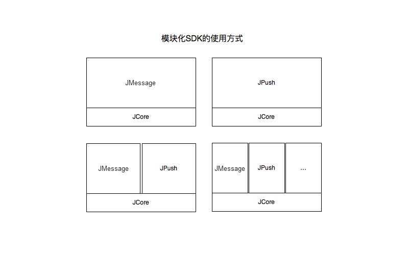

# JMessage 产品简介

## 认识极光 IM

极光 IM（英文名 JMessage）致力于帮助 App 解决应用内聊天和跨应用聊天问题，开发者可集成SDK，快速实现稳定可靠的聊天功能。目前提供 iOS / Android / web  / Windows 的 SDK，以及 Rest API 和后台管理系统，满足开发者不同场景下的需求，大大减少开发成本，提高效率。

### 模块化的极光开发者SDK

极光开发者服务SDK采用了模块化的使用模式，即一个核心模块 （JCore）+N 种服务（IM，JPush，JAnalytics）的使用方式，方便开发者同时集成多项极光开发者服务，极大的优化了多模块同时使用时功能模块重复的问题。如下图：

### JMessage 与 JPush 的区别

JMessage 以 IM 使用场景出发，面向用户根据登录帐号来收发消息；而 JPush 则满足推送场景，面向移动设备，根据设备的标签以及使用属性进行推送。

  <table border="1" width="100%">
   <thead>
    <tr  bgcolor="#D3D3D3" >
      <th > </th>
      <th >JPush</th>
      <th >JMessage</th>
    </tr>
   </thead>
   <tbody>
    <tr>
      <td>使用场景</td>
      <td>应用推送</td>
      <td>IM聊天、社交 </td>
    </tr>
    <tr >
      <td>面向对象</td>
      <td>设备</td>
      <td>用户、帐号</td>
    </tr>
    <tr >
      <td>消息对象</td>
      <td>App 运营人员或者 App Server 向用户推送</td>
      <td>用户之间互相交流</td>
    </tr>
    <tr >
      <td>发送方式</td>
      <td>支持广播、Tag，或者单设备 </td>
      <td>单聊、群聊 </td>
    </tr>
  </table>

 

### JPush 与 JMessage 服务如何选择

开发者可以根据自身业务场景来选择适用的业务。

* 如果你的应用需要实现即时通讯功能，满足用户间的互动需求，那么 JMessage 是为您准备的。
* 如果应用主要以发送功能通知，活动推广，订阅与广播内容为主，应该选择更为简洁的推送服务。如果后续业务需要扩展，可以再集成 JMessage，对原有的 Push 功能无任何影响。

## JMessage 基本概念

### username（用户名）

这是 App 的用户名，App 里用来唯一地标识其用户，必须唯一。

App 调用 IM SDK 时实际使用的，可以是其用户的 ID，用户帐号名，或者 Email，总之任何一个能唯一地标识其用户的都可以。

### groupId（群组ID）

App 使用 JMessage 提供的群组功能创建群组时得到的群组标识。发群组消息、加人、踢人等操作，都需要这个群组ID。

### AppKey（应用Key）

用来唯一标识一个 App，需要在管理控制台创建。SDK 集成时，需要配置此 Key，以便系统识别当前用户属于某个应用。

##### 说明：同一个 AppKey 里用户名必须唯一，不同的 AppKey 之间用户名可以重名。

### IM 与 JPush 的架构

上图是 JPush 与 IM 服务的整体架构图。通过此图可以理解：

+ IM SDK 中支持的推送，与 JPush 使用同一个网络长连接。
+ 服务器端接入服务器在两个服务之间是共享的。
+ 接入服务器之上，二套服务整体相对独立、分离。

### JMessage 的优势

+ 以极光推送的大规模、高并发、稳定的推送服务为技术基础，并继承这些特性。
+ IM SDK 与 JPush SDK 共用一个网络连接，同时支持 IM 与 Push 业务。
+ IM 完美兼容 Push ，已使用 Push 服务的用户可同时集成 IM，平滑升级。
+ JPush 团队之前就是开发 IM App 的，对 IM 业务具有更深刻的理解，能够持续地改进与革新 IM 服务。

## JMessage 功能与特性

### 整体特性

+ 消息类型：文字、语音、图片、地理位置、文件、自定义消息等。
+ 聊天方式：单聊、群聊。
+ 平台支持：Android, iOS，Web 多平台互通。
+ 用户维护：注册、登录、头像、用户其他信息。
+ 群组维护：创建群组、加群、退群。
+ 离线消息：可选择是否需要保存离线消息
+ 关系模式：有好友模式和无好友模式
+ 跨应用聊天：不同应用下的用户可相互通信

### REST API

提供满足 REST 规范的 HTTP API 来使用常用的功能。

有如下几个类别：

+ 注册用户（支持批量）
+ 发送消息
+ 用户信息维护
+ 用户关系维护
+ 群组维护

### 管理控制台

与 JPush 控制台集成在一起，可进行用户和群组的一些基本维护。

+ 创建应用
+ 注册用户
+ 管理用户
+ 维护群组
+ 发送消息

## 集成流程

1. 在 Web 控制台上创建应用，得到 AppKey。如果之前已经使用了 JPush，可以直接延用老的 AppKey。
2. 集成客户端 SDK。
	+ 集成 IM SDK 到 App 里。      
	  Android 开发者请参考文档：[JMessage Android SDK 集成指南](https://docs.jiguang.cn/jmessage/client/jmessage_android_guide/)  
	  iOS 开发者请参考文档：[JMessage iOS SDK 集成指南](https://docs.jiguang.cn/jmessage/client/jmessage_ios_guide/)
      
3. 通过管理控制台，或调用 REST API 管理用户，发送消息。

### 相关文档

+ [JMessage Android SDK 开发指南](../client/im_sdk_android/)
+ [JMessage iOS SDK 开发指南](../client/im_sdk_ios/)
+ [JMessage WEB SDK 开发指南](https://docs.jiguang.cn/jmessage/client/im_sdk_js/)
+ [JMessage Windows SDK 集成指南](https://docs.jiguang.cn/jmessage/client/im_sdk_win/)

  [1]: ./images/1474528956596.jpg "1474528956596.jpg"
