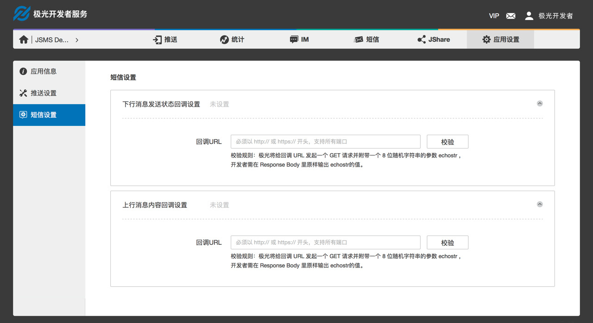
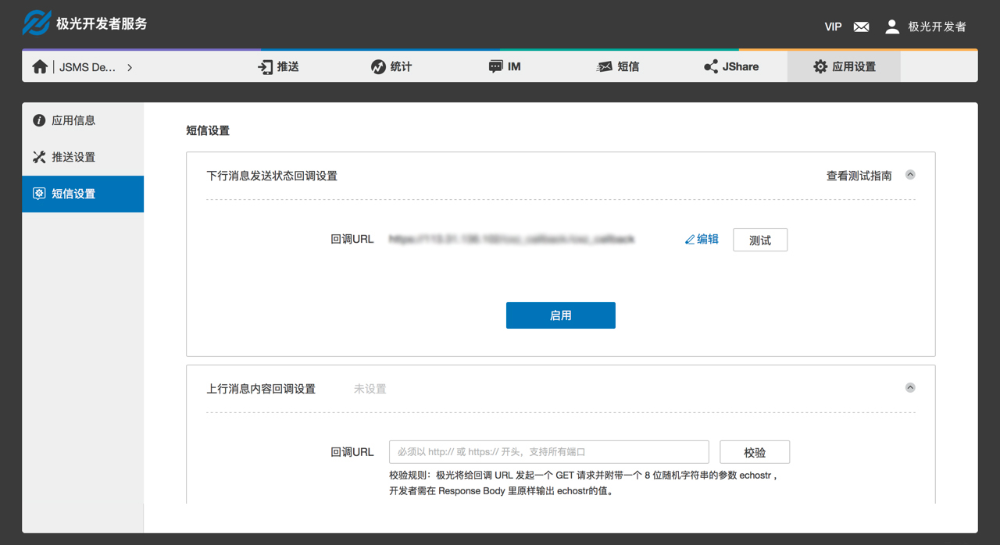

# Callback Interface

+ Set and verify the callback address;
+ Description of the callback message format;
+ Method to test the callback

## Set Callback Address

### Function Description

• Set and verify the callback address

### Operation Path

Step1: Log in to the console
Step2: Enter the application template
Step3: Select [SMS Settings] in the right menu
Step4: Click to select the callback interface


### Set Callback Address

Fill in the callback address at the console. The callback address must begin with http:// or https://. And not supports custom interface. After filling in the callback address, it must be verified before it can be used. The verification rule: Jiguang will send a GET request to the callback URL with parameter echostr of an 8-bit random string. The developer needs to output the echostr value as it is in the Response Body.

## Format of Callback Messages

### Description of Callback Method

When there is a callback message, an HTTP POST is used to submit a notification message to the developer's callback URL. It should be noted that if the callback fails, Jiguang will retry after a certain time interval and try a maximum of three times. The intervals for retried callbacks are 3 minutes, 1 hour, and 12 hours, respectively.

### The basic parameters of the callback are as follows:

KEY | REQUIRE | DESCRIPTION
----|----|----
nonce | Long | Random long integer
signature | String | Signature, generated by combing with appKey, appMasterSecret, nonce, timestamp
timestamp | Long | Current timestamp, unit as milliseconds
type | String | Notification Type (SMS_REPORT/SMS_REPLY)
data | String | Notification content, json string. Developers can deserialize data by type

### Generation and Validation Rules of the Signature:

+ Substitute values of appKey, appMasterSecret, nonce, and timestamp into the generated string appKey={appKey}&appMasterSecret={appMasterSecret}&nonce={nonce}&timestamp={timestamp};
+ Encipher sha1 to the generated string;
+ The developer compares the received signature with the signature generated from his or her own local code according to the same rule. If they are same, the callback can be assumed to come from Jiguang.

### Callback Parameters of Downstream SMS Delivery

CODE | TYPE | DESCRI MT201801002534 PTION
----|----|----
msgId | String | The msg_id returned by the API call
status | Integer | Return Code of Send Status
receiveTime | Date | SMS delivery time
phone | String | Phone number that SMS sent

### Return Code of Send Status

CODE | DESCRIPTION
--- | ---
4001 | Sent successfully
4002 | The mobile phone number called is blacklisted by the operator and needs to be handled by the operator.
4003 | Terminal problems of mobile phone, such as mobile phone shutdown, out of service, etc. Please check whether the status of the phone is normal
4004 | Number of the called mobile phone is an empty number. Please check whether the mobile number is compliant.
4005 | Amount of available SMS is insufficient.
4006 | Send overclocking
4100 | Other errors

### Callback Parameters of Upstream Message Content

CODE | TYPE | DESCRIPTION
--- | --- | ---
phone | String | Calling number (user’s phone number)
replyTime | Date | Time that the message sent to the Jiguang platform
content | String | The message content the user replies

###  Callback Parameters of Template Audit Results

CODE | TYPE | DESCRIPTION
--- | --- | ---
tempId | Integer | Template ID
status | Integer | Template status, 1 indicates that the audit passed, 2 indicates that the audit failed
refuseReason | String | Reason why the audit failed

###  Callback Parameters of Signature Audit Results

CODE | TYPE | DESCRIPTION
--- | --- | ---
signId | Integer | Signature ID
status | Integer | Signature status, 1 means the audit passed, 2 means the audit failed
refuseReason | String | Reason why the audit failed

## Callback Test

### Function Description

- Provide two ways to test the callback function
1. Callback settings page test of console
2. Curl simulates a POST callback request;

### Callback Settings Page Test of Console

The developer clicks the test button in the callback settings page and Jiguang will initiate a callback to call back the fixed test data to the callback address provided by the developer. The developer can determine whether the callback request was successful by checking whether the callback request was received and whether the received data is consistent with the following table.


### Callback Test Data of Upstream SMS Content

|KEY| VALUE|
|----|----|
|content|   TD|
|phone| 13000000000|
|replyTime| 1492150740292|

### Callback Test Data of Downstream SMS Status

|KEY| VALUE|
|----|----|
|msgId| 1857496|
|phone| 13000000000|
|receiveTime|   1492150740292|
|status|    4001|

### Callback Test Data of Template Audit Results

|KEY| VALUE|
|----|----|
|tempId|    57496|
|status|    1|
|refuseReason|  null|

### Callback Test Data of Signature Audit Results

|KEY| VALUE|
|----|----|
|signId|    123|
|status|    1|
|refuseReason|  null|

### Curl Simulates a POST Callback Request

On Linux, it is convenient to use the curl command to initiate an HTTP POST request. In Windows, you need to install the curl tool software. The following is an example of a curl simulation callback

### Callback of Upstream Messages Content

```
curl -d "nonce=7659972084945889195&timestamp=1492150740274&signature=007eff6a105503211b472802eecc42465582ba70&type=SMS_REPLY&data＝{\"content\":\"TD\",\"phone\":\"13720481024\",\"replyTime\":1492150740292}" "http://localhost:8088/callback"
```

### Callback of Downstream SMS Status

```
curl -d "nonce=7659972084945889195&timestamp=1492150740274&signature=007eff6a105503211b472802eecc42465582ba70&type=SMS_REPORT&data={\"msgId\":\"1652496\",\"phone\":\"15822889320\",\"receiveTime\":1492150741392,\"status\":4001}" "http://localhost:8088/callback"
```

### Callback of Template Audit Results

```
curl -d "nonce=7659972084945889195&timestamp=1492150740274&signature=007eff6a105503211b472802eecc42465582ba70&type=SMS_TEMPLATE&data={\"tempId\":57496,\"status\":1,\"refuseReason\":null}" "http://localhost:8088/callback"
```

### Callback of Signature Review Results

```
curl -d "nonce=7659972084945889195&timestamp=1492150740274&signature=007eff6a105503211b472802eecc42465582ba70&type=SMS_SIGN&data={\"signId\":57496,\"status\":1,\"refuseReason\":null}" "http://localhost:8088/callback"
```

#### HttpClient Simulates a POST Callback Request

The following is an example of Java language using the apache HttpClient component to simulate callbacks. The following jar packages must be introduced before use:

**pom.xml**

```
<dependency>
    <groupId>org.apache.httpcomponents</groupId>
    <artifactId>httpclient</artifactId>
    <version>4.5.2</version>
</dependency>
<dependency>
    <groupId>com.alibaba</groupId>
    <artifactId>fastjson</artifactId>
    <version>1.2.31</version>
</dependency>
```

**CallbackTest.java**

```
package cn.jiguang.sms.dev.sample;

import com.alibaba.fastjson.JSON;
import org.apache.http.HttpResponse;
import org.apache.http.NameValuePair;
import org.apache.http.client.HttpClient;
import org.apache.http.client.entity.UrlEncodedFormEntity;
import org.apache.http.client.methods.HttpPost;
import org.apache.http.impl.client.HttpClients;
import org.apache.http.message.BasicNameValuePair;

import java.io.IOException;
import java.security.MessageDigest;
import java.security.NoSuchAlgorithmException;
import java.util.*;

/**
 * Created by jiguang on 2017/4/14.
 */
public class CallbackTest {
    private final static String URL = "http://localhost:8088/callback"; // 开发者将自己的回调URL写入
    private final static String APPKEY = "dev_sample_appKey";       // 开发者将自己的appKey写入
    private final static String APPMASTERSECRET = "dev_sample_appMasterSecret"; // 开发者将自己的appMasterSecret写入
    public static void main(String[] args) throws IOException {
        long nonce = new Random().nextLong();
        long timestamp = System.currentTimeMillis();
        String str = String.format("appKey=%s&appMasterSecret=%s&nonce=%s&timestamp=%s",
                APPKEY, APPMASTERSECRET, nonce, timestamp);
        String signature = encrypt(str);
        Map<String, Object> params = new HashMap<>();
        params.put("nonce", nonce);
        params.put("timestamp", timestamp);
        params.put("signature", signature);

        // 测试用户回复消息回调
        ReplyMessage replyMessage = new ReplyMessage();
        replyMessage.setPhone("13720481024");
        replyMessage.setReplyTime(new Date());
        replyMessage.setContent("TD");
        params.put("data", JSON.toJSONString(replyMessage));
        params.put("type", "SMS_REPLY");
        System.out.println("post params: " + JSON.toJSONString(params));
        sendPost(URL, params);

        // 测试短信送达状态回调
        ReportMessage reportMessage = new ReportMessage();
        reportMessage.setMsgId("1652496");
        reportMessage.setStatus(4001);
        reportMessage.setPhone("15822889320");
        reportMessage.setReceiveTime(new Date());
        params.put("data", JSON.toJSONString(reportMessage));
        params.put("type", "SMS_REPORT");
        System.out.println("post params: " + JSON.toJSONString(params));
        sendPost(URL, params);

        // 测试短信模板审核结果回调
        TemplateMessage templateMessage = new TemplateMessage();
        templateMessage.setTempId(57496);
        templateMessage.setStatus(1);
        templateMessage.setRefuseReason(null);
        params.put("data", JSON.toJSONString(templateMessage));
        params.put("type", "SMS_TEMPLATE");
        System.out.println("post params: " + JSON.toJSONString(params));
        sendPost(URL, params);
    }

    private static void sendPost(String url, Map<String, Object> params) throws IOException {
        HttpClient httpClient = HttpClients.custom().build();
        HttpPost httpPost = new HttpPost(url);
        List<NameValuePair> formParams = new ArrayList<>();
        for (Map.Entry<String, Object> entry : params.entrySet()) {
            formParams.add(new BasicNameValuePair(entry.getKey(), entry.getValue().toString()));
        }
        UrlEncodedFormEntity uefEntity = new UrlEncodedFormEntity(formParams, "UTF-8");
        httpPost.setEntity(uefEntity);
        HttpResponse response = httpClient.execute(httpPost);
        System.out.println("response: " + JSON.toJSONString(response));
    }

    private static class ReplyMessage {
        private String phone;
        private Date replyTime;
        private String content;
        public String getPhone() {
            return phone;
        }
        public void setPhone(String phone) {
            this.phone = phone;
        }
        public String getContent() {
            return content;
        }
        public void setContent(String content) {
            this.content = content;
        }
        public Date getReplyTime() {
            return replyTime;
        }
        public void setReplyTime(Date replayTime) {
            this.replyTime = replayTime;
        }
    }

    private static class ReportMessage {
        private String msgId;
        private Integer status;
        private String phone;
        private Date receiveTime;
        public String getMsgId() {
            return msgId;
        }
        public void setMsgId(String msgId) {
            this.msgId = msgId;
        }
        public Integer getStatus() {
            return status;
        }
        public void setStatus(Integer status) {
            this.status = status;
        }
        public String getPhone() {
            return phone;
        }
        public void setPhone(String phone) {
            this.phone = phone;
        }
        public Date getReceiveTime() {
            return receiveTime;
        }
        public void setReceiveTime(Date receiveTime) {
            this.receiveTime = receiveTime;
        }
    }

    private static class TemplateMessage {
        private Integer tempId;
        private Integer status;
        private String refuseReason;
        public Integer getTempId() {
            return tempId;
        }
        public void setTempId(Integer tempId) {
            this.tempId = tempId;
        }
        public Integer getStatus() {
            return status;
        }
        public void setStatus(Integer status) {
            this.status = status;
        }
        public String getRefuseReason() {
            return refuseReason;
        }
        public void setRefuseReason(String refuseReason) {
            this.refuseReason = refuseReason;
        }
    }

    /**
     * SHA1加密
     *
     * @param strSrc 明文
     * @return 加密之后的密文
     */
    public static String encrypt(String strSrc) {
        MessageDigest md = null;
        String strDes = null;
        byte[] bt = strSrc.getBytes();
        try {
            md = MessageDigest.getInstance("SHA-1");// 将此换成SHA-1、SHA-512、SHA-384等参数
            md.update(bt);
            strDes = bytes2Hex(md.digest()); // to HexString
        } catch (NoSuchAlgorithmException e) {
            return null;
        }
        return strDes;
    }

    /**
     * byte数组转换为16进制字符串
     *
     * @param bts 数据源
     * @return 16进制字符串
     */
    private static String bytes2Hex(byte[] bts) {
        String des = "";
        String tmp = null;
        for (int i = 0; i < bts.length; i++) {
            tmp = (Integer.toHexString(bts[i] & 0xFF));
            if (tmp.length() == 1) {
                des += "0";
            }
            des += tmp;
        }
        return des;
    }
}
```
