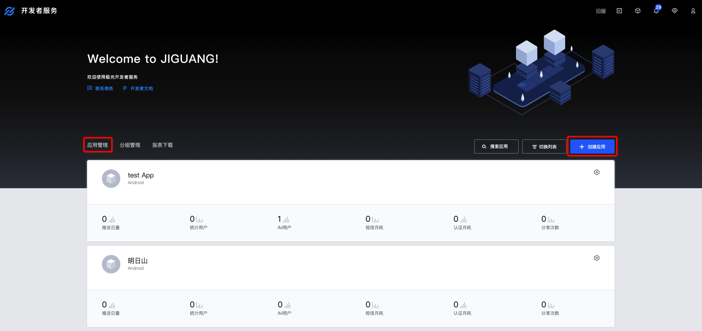
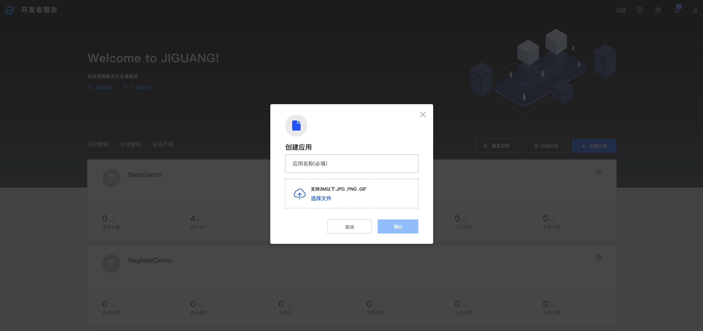

# 极光统计 Android SDK 集成指南

##使用提示

本文是JAnalytics Android SDK 标准的集成指南文档。

匹配的 SDK 版本为：v1.0.0及以后版本。

+ 如果您想要快速地测试、请参考本文在几分钟内跑通Demo。
+ 极光推送文档网站上，有相关的所有指南、API、教程等全部的文档。包括本文档的更新版本，都会及时地发布到该网站上。

##产品说明
利用事件模板统计App用户的行为事件并上报给极光服务器，极光提供加工过的数据通过WebPortal展示给开发者，让开发者更加了解自己的应用在用户手中的使用情况。
###主要场景：

	1.统计页面流
	2.统计自定义计数事件
	3.统计自定义计算事件
    4.动态圈选功能（JAnalytics2.0.0开始支持）

###janalytics-android-release-2.x.y.zip 集成压缩包内容

+ AndroidManifest.xml
	+ 客户端嵌入SDK参考的配置文件
+ libs/jcore-android_v1.x.x.jar
	+ sdk 核心包
+ libs/xxx/xx.so
	+ sdk需要用的so文件
+ libs/janalytics-android-sdk_v2.x.x.jar
	+ SDK analysis 开发包
+ example
	+ 是一个完整的 Android 项目，通过这个演示了 JAnalysis SDK 的基本用法，可以用来做参考。

###Android SDK 版本
目前SDK只支持Android 2.3或以上版本的手机系统。   
动态圈选功能只支持Android4.2或以上版本的手机系统。   

###Gradle 版本
动态圈选功能建议使用gradle版本为3.3，gradle插件版本2.3.2。     
在gradle-wrapper.properties里配置   
distributionUrl=https\://services.gradle.org/distributions/gradle-3.3-all.zip  

##创建应用

###创建极光开发者帐号

请访问[极光推送官方网站](https://www.jiguang.cn/push) 注册您的极光账号。

###Portal上创建应用

使用注册账号登陆，进入极光控制台-应用管理，点击「创建应用」按钮，进入创建应用的界面。输入应用名称和上传好应用图标（非必填），点击「确认」即可创建应用。

###查看应用信息

创建好应用后，如果想要查看该应用的详细信息，可点击应用条目右侧的「设置」按钮进入【应用信息】页面。

## JCenter 自动集成方式

***说明1*** ： 使用jcenter自动集成的开发者，不需要在项目中添加jar，jcenter会自动完成依赖；jcenter 也会自动导入 JAnalytics 所需的权限和 meta-data 节点进你项目的 AndroidManifest 中。   
***说明2*** ： 想添加动态圈选功能的开发者，将以下集成步骤与动态圈选相关的配置加上即可

+ 确认android studio的 Project 根目录的主 gradle 中配置了jcenter支持。

        buildscript {
            repositories {
                jcenter()
            }
            ......
            dependencies {
                //gradle建议版本
                classpath 'com.android.tools.build:gradle:2.3.2'
                //可选: 动态圈选plugin
                classpath 'cn.jiguang.android:janalytics-gradle-plugin:2.0.0'
            }
        }

        allprojects {
            repositories {
                jcenter()
            }
        }

+ 在 module 的 gradle 中添加依赖和AndroidManifest的替换变量。

        //可选：动态圈选需要的插件。如果已经集成了动态圈选功能，又想关闭，只注释掉这行配置代码即可
        apply plugin: 'cn.jiguang.android.analytics'    
        
        android {
            ......
            defaultConfig {
                applicationId "com.xxx.xxx" // 你应用的包名.
                ......

                manifestPlaceholders = [
                    JPUSH_APPKEY : "你的appkey", //JPush上注册的包名对应的appkey.
                    JPUSH_CHANNEL : "developer-default", //暂时填写默认值即可.
                ]
                ......
            }
            ......
        }

        dependencies {
            ......

            compile 'cn.jiguang.sdk:janalytics:2.0.0' // 此处以JAnalytics 2.0.0 版本为例。
            compile 'cn.jiguang.sdk:jcore:1.2.6' // 此处以JCore 1.2.6 版本为例。
            ......
        }

+ 可选：动态圈选功能，需要在你的AndroidManifest.xml里，主页面Activity标签下添加intent-filter，以实现扫码唤出圈选功能

        <!-- 应用主页面-->
        <activity
            android:name=".MainActivity"
            android:exported="true"
            android:label="@string/app_name"
            android:launchMode="singleTask">
            <intent-filter>
                <action android:name="android.intent.action.MAIN" />
                <category android:name="android.intent.category.LAUNCHER" />
            </intent-filter>
            <!--可选：动态圈选需要单独添加这个intent-filter 区块-->
            <intent-filter>
                <action android:name="android.intent.action.VIEW" />
                <category android:name="android.intent.category.DEFAULT"/>
                <category android:name="android.intent.category.BROWSABLE"/>
                <data android:scheme="jiguang-您应用的APPKEY" android:host="jiguang" />
            </intent-filter>
        </activity>

##本地工程配置  
***说明*** ： 想添加动态圈选功能的开发者，需要将以下集成步骤与动态圈选相关的配置加上即可

+ 解压压缩包，将libs下的所有文件复制到工程的libs下面.
	+ jcore 和 janalytics 两个 jar 文件。
	+ 所有 CPU 平台的 so 文件。
+ 配置 AndroidManifest:

			 <!-- 必需  一些系统要求的权限，如 访问网络等-->
            <uses-permission android:name="android.permission.INTERNET" />
            <uses-permission android:name="android.permission.WAKE_LOCK" />
            <uses-permission android:name="android.permission.READ_PHONE_STATE" />
            <uses-permission android:name="android.permission.WRITE_EXTERNAL_STORAGE" />
            <uses-permission android:name="android.permission.READ_EXTERNAL_STORAGE" />
            <uses-permission android:name="android.permission.ACCESS_NETWORK_STATE" />
            <uses-permission android:name="android.permission.ACCESS_WIFI_STATE" />

         	<!-- 可选 -->
            <uses-permission android:name="android.permission.VIBRATE" />
            <uses-permission android:name="android.permission.MOUNT_UNMOUNT_FILESYSTEMS" />
            <uses-permission android:name="android.permission.WRITE_SETTINGS" />
            <uses-permission android:name="android.permission.RECEIVE_USER_PRESENT" />
            <uses-permission android:name="android.permission.SYSTEM_ALERT_WINDOW" />
            <uses-permission android:name="android.permission.ACCESS_COARSE_LOCATION" />
            <uses-permission android:name="android.permission.CHANGE_WIFI_STATE" />
            <uses-permission android:name="android.permission.ACCESS_FINE_LOCATION" />
            <uses-permission android:name="android.permission.ACCESS_LOCATION_EXTRA_COMMANDS" />
            <uses-permission android:name="android.permission.CHANGE_NETWORK_STATE" />
            <uses-permission android:name="android.permission.GET_TASKS" />
            
            <activity
                android:name=".MainActivity"
                android:exported="true"
                android:label="@string/app_name"
                android:launchMode="singleTask">
                <intent-filter>
                    <action android:name="android.intent.action.MAIN" />
                    <category android:name="android.intent.category.LAUNCHER" />
                </intent-filter>
                <!-- 可选：动态圈选需要在主页面Activity标签下添加这个intent-filter 区块，以实现扫码唤出圈选功能-->
                <intent-filter>
                    <action android:name="android.intent.action.VIEW" />
                    <category android:name="android.intent.category.DEFAULT"/>
                    <category android:name="android.intent.category.BROWSABLE"/>
                    <data android:scheme="jiguang-您应用的APPKEY" android:host="jiguang" />
                </intent-filter>
            </activity>
            
            <!-- 可选： 动态圈选圈选必要的Activity-->
            <activity android:name="cn.jiguang.analytics.android.view.BuryWebActivity"
                    android:theme="@android:style/Theme.NoTitleBar"
                    android:screenOrientation="portrait"/>

            <!-- 配置appkey：从 portal 上应用信息中获取 AppKey，并填写你的 Channel-->
			<meta-data android:name="JPUSH_APPKEY" android:value="Your AppKey"/>
			<meta-data android:name="JPUSH_CHANNEL" android:value="Your Channel"/>
			
+ 可选：动态圈选功能，在android studio的 Project 根目录的主 gradle 中配置插件支持。

        buildscript {
            repositories {
                jcenter()
            }
            ......
            dependencies {
                //gradle建议版本
                classpath 'com.android.tools.build:gradle:2.3.2'
                //可选: 动态圈选plugin
                classpath 'cn.jiguang.android:janalytics-gradle-plugin:2.0.0'
            }
        }

        allprojects {
            repositories {
                jcenter()
            }
        }

+ 可选：动态圈选功能，在 module 的 gradle 中添加插件依赖。如果已经集成了动态圈选功能，又想关闭，只注释掉这行配置代码即可

        apply plugin: 'cn.jiguang.android.analytics'
        
        
        
+ 混淆相关：在混淆文件中添加以下配置，防止 sdk 的接口被混淆。

			-keep public class cn.jiguang.analytics.android.api.** {
    			*;
			}

##添加代码

### 基础 API

+ 初始化 sdk ： 传入 application 的 context 来初始化 sdk 。

		JAnalyticsInterface.init(Context context);

+ 设置调试模式：参数为 true 表示打开调试模式，可看到 sdk 的日志。

		JAnalyticsInterface.setDebugMode(boolean isDebugMode);

### 更多 API

其他 API 的使用方法请参考接口文档：[Android SDK API](http://docs.jiguang.cn/janalytics/client/android_api/)

### 运行 demo

压缩包附带的 example 是一个 API 演示例子。你可以将它导入到你的工程，并将你的 AppKey 填入到 example 的 AndroidManifest 中，然后直接运行起来测试。

## 技术支持

邮件联系：[support&#64;jiguang.cn](mailto:support&#64;jiguang.cn)
