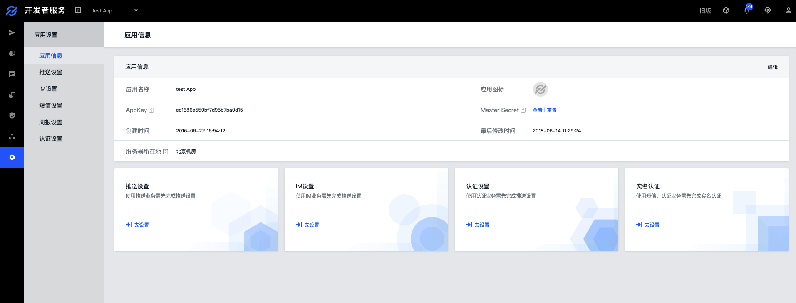
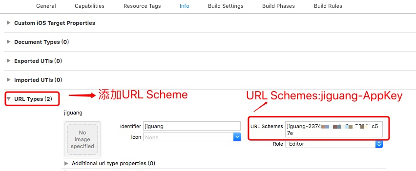

# 极光统计 iOS SDK 集成指南

##使用提示

本文是JAnalytics iOS SDK 标准的集成指南文档。

匹配的 SDK 版本为：v1.0.0及以后版本。

+ 如果您想要快速地测试、请参考本文在几分钟内跑通Demo。
+ 极光推送文档网站上，有相关的所有指南、API、教程等全部的文档。包括本文档的更新版本，都会及时地发布到该网站上。

##产品功能说明
利用事件模版统计App用户的行为事件并上报给极光服务器，极光提供加工过的数据通过WebPortal展示给开发者，让开发者更加了解自己的产品在用户手中的使用情况。
###主要场景：

	1.统计页面流
	2.统计事件：JAnalytics将事件统计模型化，目前提供了六种事件模型（登录，注册，购买，内容浏览，自定义计数事件，自定义计算事件）
	3.动态圈选埋点统计（v2.0.0及以上版本支持）

###集成压缩包内容

+	janalytics-ios-x.x.x.a静态库
+	jcore-ios-x.x.x.a静态库
+	统计入口JANALYTICSService.h头文件
+	统计事件对象文件JANALYTICSEventObject.h头文件
+	一个完整的 iOS Demo项目，通过这个演示了 JAnalytics SDK 的基本用法，可以用来做参考

###iOS SDK 版本
目前SDK只支持iOS 7以上版本的手机系统。

## 创建应用

* 创建成功后自动生成 AppKey 用以标识该应用。



##SDK导入
**选择1：Cocoapods导入**

* 通过Cocoapods下载地址：

```
pod 'JAnalytics'
```
* 如果需要安装指定版本则使用以下方式（以1.2.0版本为例）：

```
pod 'JAnalytics', '1.2.0'
```

**选择2：手动导入**

+ 在极光官网下载[最新SDK](http://docs.jiguang.cn/janalytics/resources/)
+ 解压压缩包，将Lib下的所有文件复制到工程中
+ 增加相关的framework依赖
	+ UIKit
	+ SystemConfiguration
	+ CoreTelephony
	+ CoreGraphics
	+ Security
	+ Foundation
	+ CoreLocation
	+ CoreFoundation
	+ CFNetwork
	+ libz.tbd
	+ libresolv.tbd
	+ libsqlite3.tbd（v2.0.0及以上版本需要）

+ 可以开始使用统计SDK了！

##设置URL Schemes
v2.0.0及以上版本激活圈选功能需要

请进入工程配置，选择Info，添加相应URL Schemes，如图



##添加头文件
请将以下代码添加到 AppDelegate.m 引用头文件的位置

~~~
	// 引入JAnalytics功能所需头文件
	#import "JANALYTICSService.h"
	// 如果需要使用idfa功能所需要引入的头文件（可选）
	#import <AdSupport/AdSupport.h>
~~~

##添加初始化代码

请将以下代码添加到
-(BOOL)application:(UIApplication \*)application didFinishLaunchingWithOptions:(NSDictionary \*)launchOptions

~~~
	JANALYTICSLaunchConfig * config = [[JANALYTICSLaunchConfig alloc] init];
 
	config.appKey = @"your appkey";
	 
	config.channel = @"channel";
	 
	[JANALYTICSService setupWithConfig:config];
~~~

##添加激活圈选代码
v2.0.0及以上版本需要

请实现以下方法并调用[JANALYTICSService handleUrl:]，在调试时确保函数[JANALYTICSService handleUrl:]会被执行到

~~~
- (BOOL)application:(UIApplication *)application openURL:(NSURL *)url sourceApplication:(NSString *)sourceApplication annotation:(id)annotation {
    if ([JANALYTICSService handleUrl:url]) {
        return YES;
    }
    return NO;
}
~~~

若您在 AppDelegate 中实现了以下一个或多个方法，请在已实现的函数中，调用[JANALYTICSService handleUrl:]

~~~
- (BOOL)application:(UIApplication *)application openURL:(NSURL *)url sourceApplication:(nullable NSString *)sourceApplication annotation:(id)annotation
- (BOOL)application:(UIApplication *)application handleOpenURL:(NSURL *)url
- (BOOL)application:(UIApplication *)app openURL:(NSURL *)url options:(NSDictionary<NSString*, id> *)options
~~~


### 更多 API

其他 API 的使用方法请参考接口文档：[iOS SDK API](ios_api)

### 运行 demo

压缩包附带的 demo 是一个 API 演示例子。您可以将它导入到您的工程，并将您的 AppKey 填入到 demo 的 AppDelegate 中，设置上BundleID然后直接运行起来测试。


## 技术支持

邮件联系：[support&#64;jiguang.cn](mailto:support&#64;jiguang.cn)
