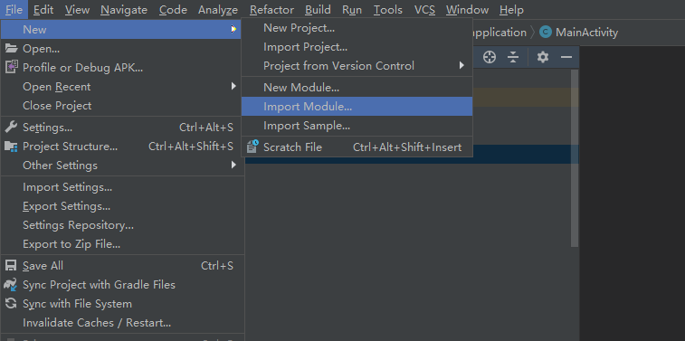
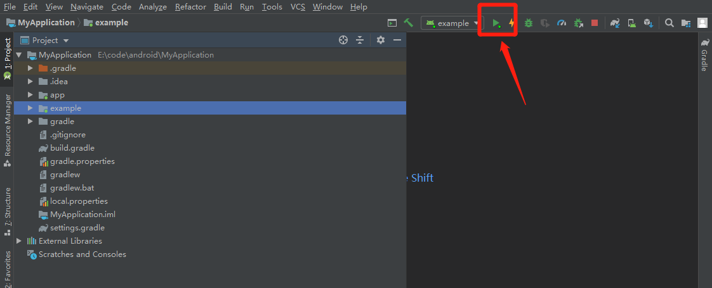

# Android SDK 集成指南

## 使用提示
本文是 JIoT Android SDK 标准的集成指南文档。用以指导 SDK 的使用方法，默认读者已经熟悉 Android Studio 的基本使用方法，以及具有一定的 Android 编程知识基础。
本篇指南匹配的 JIoT Android SDK 版本为：1.0.0 及以后版本。

## Android 系统版本支持
兼容 Android 4.0 及以上版本。

## jiot-android-1.x.x-release.zip 集成压缩包内容

* libs/jiot-android-1.x.x.jar
    * JIoT SDK 开发包。
* libs/(cpu-type)/libjiot1xx.so
    * JIoT所需要的各种 CPU 类型的 native 开发包。
* llibs/(cpu-type)/libssl.so
    * 所需要的OpenSSL的各种 CPU 类型的 native 开发包。
* llibs/(cpu-type)/libcrypto.so
    * 所需要的OpenSSL的各种 CPU 类型的 native 开发包。
* example
    * 是一个完整的 Android 项目，通过这个演示了 JIoT SDK 的基本用法，可以用来做参考。

## 手动集成步骤
* 解压缩 jiot-android-1.x.x-release.zip 集成压缩包。
* 复制 libs/jiot-android-1.x.x.jar 到工程 libs/ 目录下。
* 复制 libs/(cpu-type)/libjiot1xy.so ， libs/(cpu-type)/libssl.so ， libs/(cpu-type)/libcrypto.so 到你的工程中存放对应 cpu 类型的目录下。

**说明 1**：使用 android studio 的开发者，如果使用 jniLibs 文件夹导入 so 文件，则仅需将所有 cpu 类型的文件夹拷进去；如果将 so 文件添加在 module的libs 文件夹下，注意在 module 的 gradle 配置中添加一下配置：

```
 android {
       ......
       sourceSets {
           main {
               jniLibs.srcDirs = ['libs']
               ......
           }
           ......
       }
       ......
   }
```
## 配置 AndroidManifest.xml
添加INTERNET权限即可
<uses-permission android:name="android.permission.INTERNET" />

## 集成 JIoT Android SDK 的混淆
* 请下载 4.x 及以上版本的 proguard.jar， 并替换你 Android SDK "tools\proguard\lib\proguard.jar"
* 请在工程的混淆文件中添加以下配置：

```
-dontoptimize
-dontpreverify

-dontwarn cn.jiguang.**
-keep class cn.jiguang.** { *; }
```
## 快速编译运行Demo

### 1.使用IDE工具Android Studio 导入Example 模块
在 Android Studio 中，打开一个工程， 通过 File -> Open... 打开 JIoT Example 所在目录


### 2.运行Demo
在 Android Studio 中，运行这个Module， 通过 点击“绿色三角形”运行Example模块（前提是能够通过adb控制一个Android设备

### 3.查看Android设备Demo运行状况


## demo使用帮助
### 属性设置验证步骤:
1. 运行Demo App，并点击“连接MQTT”，显示Client connected
2. 通过 postman工具调用JIOT平台的属性设置API接口
3. Demo App日志显示"Client receive message(about set property) from server ..."
4. 验证完成，退出App

### 消息下发验证步骤:
1. 运行Demo App，并点击“连接MQTT”，显示Client connected
2. 通过 postman工具调用JIOT平台的消息下发API接口，下发消息close
3. Demo App日志显示"Client receive message(about msg deliver) from server ... message = close"
4. 验证完成，退出App
### 属性上报验证步骤:
1. 运行Demo App，并点击“连接MQTT”，显示Client connected
2. 输入正确的Property Name和Value
3. 点击App界面“上报设备属性”
4. Demo App日志显示"Client receive message(about report property) from server ..."
5. 验证完成，退出App

### 事件上报验证步骤:
1. 运行Demo App，并点击“连接MQTT”，显示Client connected
2. 输入正确的Event Name和Content
3. 点击App界面“上报事件请求”
4. Demo App日志显示"Client receive message(about report event) from server ..."
5. 验证完成，退出App

### 版本上报验证步骤:
1. 运行Demo App，并点击“连接MQTT”，显示Client connected
2. 输入正确的Seq NO和Version
3. 点击App界面“上报设备版本”
4. Demo App日志显示"Client receive message(about report version) from server ..."
5. 验证完成，退出App